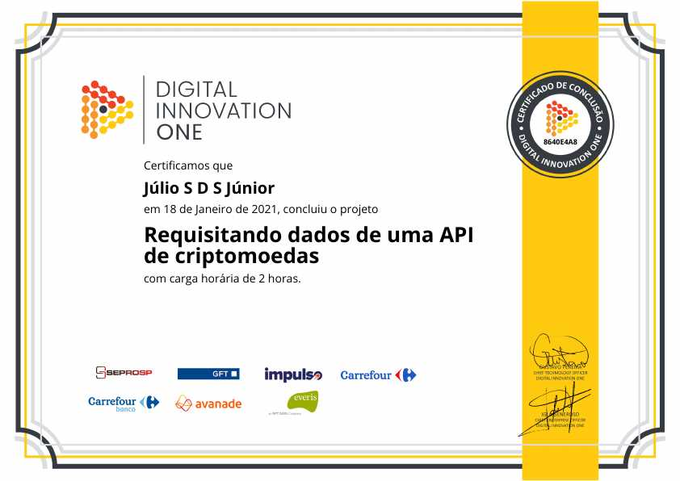

# Requisitando dados de uma API de criptomoedas
## [Digital Innovation One](https://web.digitalinnovation.one/)

* JavaScript  
* [API Coin Market Cap](https://pro.coinmarketcap.com/account)  

Instrutora: Bárbara Casac

"Aprenda a fazer uma requisição de uma API de Criptomoeda com JavaScript. Para você que está começando a carreira de TI e gostaria de manipular APIs além de exibir essas informações em uma página web responsiva."

 
